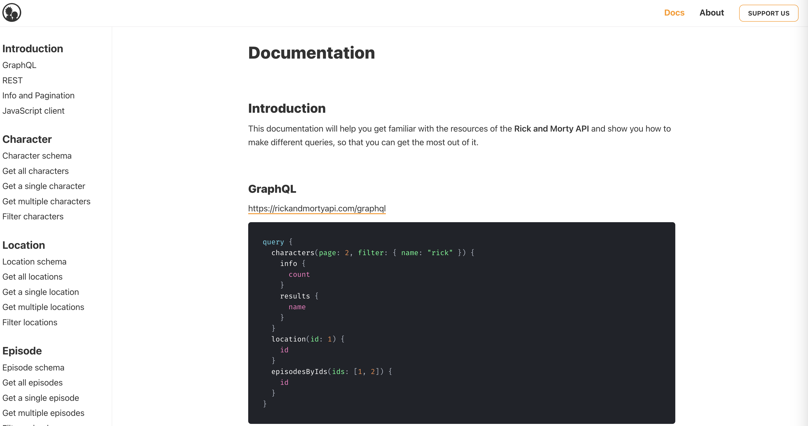

# Rick and Morty

Rick and Morty Show Listing app.

[https://rick-and-morty-delta-lyart-67.vercel.app/](https://rick-and-morty-delta-lyart-67.vercel.app/)


## Running the App

Before running this app locally, please make sure you have the following:

Latest LTS version of [Node.js](https://nodejs.org/en/) `>=18.17.0`

To run the development server, use the following command:

```bash
npm run dev
```

## Codebase

The codebase is bootstrapped using the following libraries.

- [Nextjs](https://www.npmjs.com/package/create-next-app)
- [ChakraUI](https://www.npmjs.com/package/@chakra-ui/react)
- [Jest](https://www.npmjs.com/package/jest)
- [React Testing Library](https://www.npmjs.com/package/@testing-library/react?activeTab=readme)
- [apollo/client](https://www.npmjs.com/package/@apollo/client)
- [graphql](https://www.npmjs.com/package/graphql)

I only added a few dependencies, usually dev dependencies for testing, as everything can be done using Next.js and ChakraUI.

## Features


1. **Welcome Modal:**

   - ✅ First Slide: Allows the user to set a username.
   - ✅ Second Slide: Allows the user to set their job title.

2. **User Info Management:**

   - ✅ Save the user’s username and job title information.
   - ✅ Store the information in a persistent manner. I use `localStorage` for data persistance.
   - ✅ Provide an interface for users to view and change their information after logging in. The boxes on the information page are editable, and the data will be automatically saved after editing.

3. **GraphQL Integration with Apollo Client:**

   - ✅ Use Apollo Client to query a public GraphQL API.

4. **Information Page:**

   - ✅ Create an "Information Page" that is mobile and tablet compatible.
   - ✅ Users should only be able to access the "Information Page" after setting their information. I have implemented a guard for this.

5. **Display GraphQL Data:**

   - ✅ Display the data obtained from the GraphQL API as items on the "Information Page."

6. **Modal for Item Details:**

   - ✅ When clicking on a listed item on the "Information Page," open a modal.
   - ✅ The modal should display detailed information about the selected item.

7. **Bonus:**
   - ✅ Pagination
   - ✅ Navigation Bar for displaying the user info.

## Tests

I have covered a good test coverage on this project, the testing covers the following components:


## Graphql API

I chose "Rick and Morty" from the list at https://github.com/graphql-kit/graphql-apis because it has comprehensive documentation and includes one of the few remaining demo APIs that still work based on the provided sample. Unfortunately, other samples are either no longer available or have been removed by their respective authors.



## Contributing

If you've got an improvement, just send in a pull request. If you've got feature ideas, simply [open a new issues](https://github.com/chardmd/rick-and-morty/issues/new)!

## Author

Richard Dimalanta [https://chardmd.com](http://chardmd.com)
